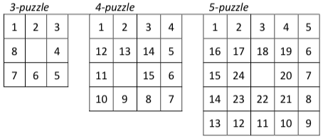

# N-Puzzle
## Table of Contents
* [Introduction](#introduction)
* [Python Requirements](#python-requirements)
* [Generate puzzle](#generate-puzzle)
  * [Usage](#usage)
  * [Exemple](#exemple)
* [Solve puzzle](#solve-puzzle)
  * [Usage](#usage-1)
  * [Exemple](#exemple-1)
* [More info](#more-info)
  
## Introduction
The goal of this project is to solve the N-puzzle ("taquin" in French) game using the A*
search algorithm or one of its variants.  
  
You start with a square board made up of N\*N cells. One of these cells will be empty,
the others will contain numbers, starting from 1, that will be unique in this instance of
the puzzle.  
  
Your search algorithm will have to find a valid sequence of moves in order to reach the
final state, a.k.a the "snail solution", which depends on the size of the puzzle (Example
below). While there will be no direct evaluation of its performance in this instance of the
project, it has to have at least a vaguely reasonable perfomance : Taking a few second to
solve a 3-puzzle is pushing it, ten seconds is unacceptable.  
  

  
The only move one can do in the N-puzzle is to swap the empty cell with one of its
neighbors (No diagonals, of course. Imagine you’re sliding a block with a number on it
towards an empty space).  
  
## Python Requirements
**install requirements:** <code>$ python3 -m pip install -r requirements.txt</code>  
  
## Generate puzzle
### Usage
<pre><code>usage: generator.py [-h] [-s SHUFFLE] size

positional arguments:
  size                  N-puzzle size. Must be ≥ 3

optional arguments:
  -h, --help            show this help message and exit
  -s SHUFFLE, --shuffle SHUFFLE
                        Number of shuffle</code></pre>  
  
### Exemple
<pre><code>$ python3 generator.py 3
# This puzzle is solvable
3
7 5 0
8 1 6
2 4 3</code></pre>  
  
## Solve puzzle
### Usage
<pre><code>usage: main.py [-h] [-A {astar,greedy,uniform}]
               [-H {manhattan,hamming,euclidean}]
               file

positional arguments:
  file                  N-puzzle file

optional arguments:
  -h, --help            show this help message and exit
  -A {astar,greedy,uniform}, --algorithm {astar,greedy,uniform}
                        Choise algorithm for N-puzzle. Default: astar
  -H {manhattan,hamming,euclidean}, --heuristic {manhattan,hamming,euclidean}
                        Choise heuristic for N-puzzle. Default: manhattan</code></pre>  
  
### Exemple
<pre><code>$ python3 main.py npuzzle.txt
Complexity in time: 2936
Complexity in size: 1734
Number of moves: 26
Solution:

Step 0:
7 5 0
8 1 6
2 4 3

Step 1:
7 0 5
8 1 6
2 4 3

[...]

Step 26:
1 2 3
8 0 4
7 6 5</pre></code>
  
## More info
**Autor:** [Antoine Mauffret](https://github.com/AntoineMau)  
  
**Subject:** [N-puzzle](https://cdn.intra.42.fr/pdf/pdf/2024/npuzzle.en.pdf)
